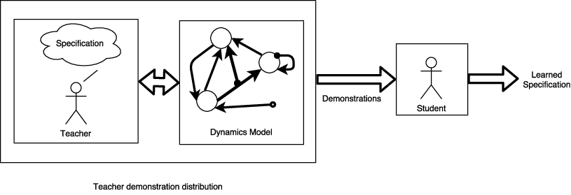

[](https://travis-ci.org/mvcisback/yasit)
[](https://codecov.io/gh/mvcisback/yasit)
[](https://pyup.io/repos/github/mvcisback/yasit/)

[](https://badge.fury.io/py/yasit)
[](https://opensource.org/licenses/MIT)

# (Y)et (a)nother (s)pecification (i)nference (t)ool

Yasit is a tool for learning "Boolean Specifications" from
demonstrations. In particular, we are given a set of examples from an
agent (also called the teacher) who is performing some task in an
environment and ask what is the most likey task given the examples
(also called the demonstrations).

<figure>
  
</figure>

The main purpose of `yasit` is to take a collection of demonstrations
and collection of candidate specifications and find the most probable
one specification. 

For details on the posteori probability model and algorithm see:
[Vazquez-Chanlatte, Marcell, et al. "Learning Task Specifications from
Demonstrations.", Advances in Neural Information Processing Systems,
NIPS, 2018](https://arxiv.org/abs/1710.03875).

## Usage

`yasit`'s API centers around the `infer` function. For example, let
`concept_class` denote an iterable container (e.g., a `Set` or `List`)
of python objects, supporting the `__call__` and `__le__` dunder
methods as well as the `rand_sat` method which computes the
probability of satisfying the property given a common starting point
for all the demonstrations.

- Note: `yasit` currently only supports each demonstration starting at
  the same location. Future versions will relax this condition, but
  will require `#unique_starting_points` queries to `rand_sat`
  to evaluate the probability of a given property.

For example,

```python
class TraceProperty:
    def __hash__(self):
        '''Must be hashable.'''

    def __call__(self, demonstration) -> bool:
        '''Evaluate if the provided demonstration satisifies this property.'''

    def __le__(self, other) -> bool:
        '''
        - Evaluate if (self) is known to imply (other).
        - As sets, this corresponds to subset inclusion.
        - If __le__ is constantly False, then the algorithm
          will compute the probability of *every* property and
          return the maximimum.
        - Only required if giving `concept_class` as a
          flat list of specifications.
        '''

    def rand_sat(self) -> [0, 1]:
        '''
        Return the probability (in interval [0, 1]) of randomly satisifying 
        the property if one applies actions uniformly at random from the
        starting point.
        '''
```

Then if `concept_class` is an iterable of objects conforming to
`TraceProperty`'s API, and `demonstrations` is an iterable of
demonstrations (inputs to `__call__`), finding the most probable
specification is done by:

```python
from yasit import infer

spec, score = infer(concept_class, demonstrations)
```

`infer` also supports taking in a `networkx.DiGraph`. In fact, if
`concept_class` is not a `DiGraph`, the first thing `infer` does it
make it one. The currently procedure to do this is fairly slow and
makes numerous `<=` queries. If these are slow, you may wish to
implement your own `concept_class` to `DiGraph` converter. 

- Note, that the resulting graph should be transitively reduced. This
  can be done using `networkx.transitive_reduction`.
- If `concept_class` is given as a `networkx.DiGraph`, then the
  `TraceProperty` dunder method, `__leq__`, does *not* need to be
  implemented.
